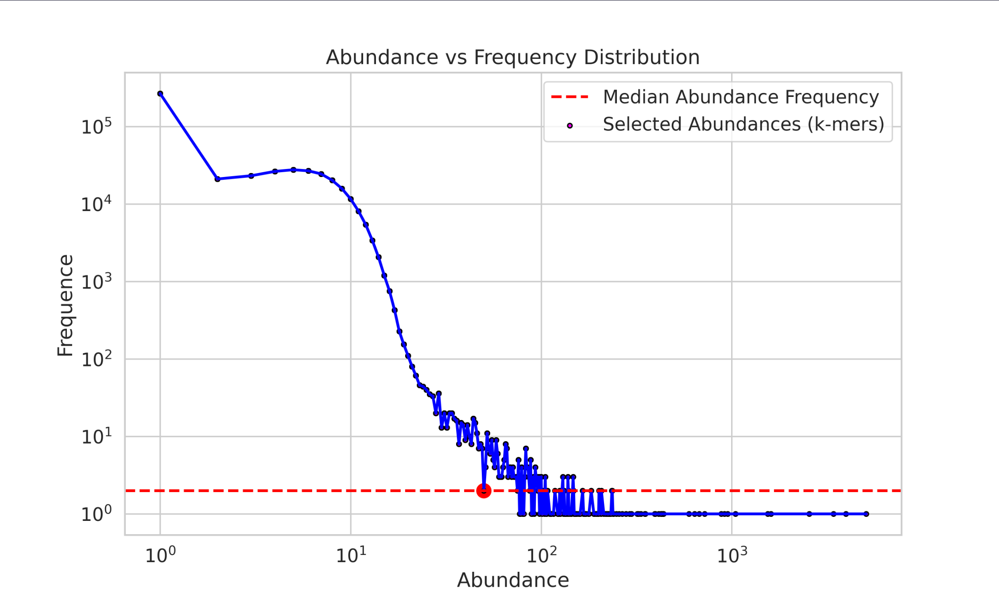

# sourmash_plugin_RandSampling


The RandSampling plugin performs weighted-random-sampling to extract a max number of k-mers from a signature using their abundance distribution.

 The main aim is to extract k-mers from large signatures with different coverages (abundances) to create a smaller signature with a more uniform coverage distribution.

The `--force` option allows you to force the extraction of a signature in case it's empty or has fewer than `max_kmers`. This is useful in workflows (e.g. snakemake).

The `--plot` option allows you to plot the abundance distribution of the input and output signatures.



The figure illustrates the relationship between abundance (x-axis) and frequency (y-axis) in the context of k-mer extraction. In the plot, the median abundance frequency is indicated by a horizontal line, and the selected abundances are represented by individual dots. Specifically, this visualization reflects the process of extracting 100,000 k-mers from a pool of approximately 500,000 k-mers, highlighting the weighted-random-sampling technique used to create a more uniform distribution.


## Installation

Make sure you have an updated pip version:

```bash
# update pip
pip install --upgrade pip

# or 
conda update pip
```

Then install the plugin:


```
pip install git+https://github.com/sourmash-bio/sourmash_plugin_randsampling.git
```

## Usage

```bash
sourmash scripts randsampling --help
```

```bash
usage:  randsampling [-h] [-q] [-d] --sig SIG -m MAX_KMERS -k K -o OUT [--plot] [--force]

options:
  -h, --help            show this help message and exit
  -q, --quiet           suppress non-error output
  -d, --debug           provide debugging output
  --sig SIG             path to signature file
  -m MAX_KMERS, --max-kmers MAX_KMERS
                        maximum number of kmers to extract
  -k K                  kmer size
  -o OUT, --out OUT     path to output signature file
  --plot                plot abundance distribution
  --force               force write new signature if empty or <max_kmers
```

## Example
    
```bash
sourmash scripts randsampling  -k 51 --sig large.sig --max-kmers 1000 --plot --force -o subsampled.sig
```